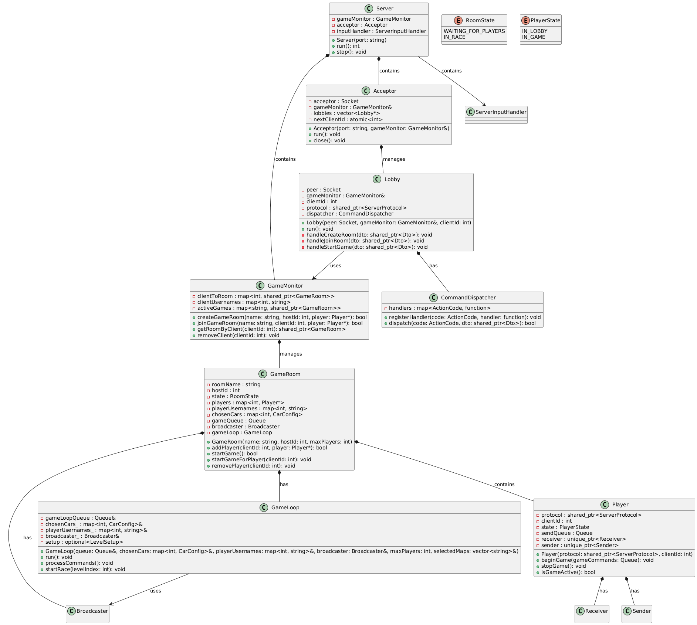
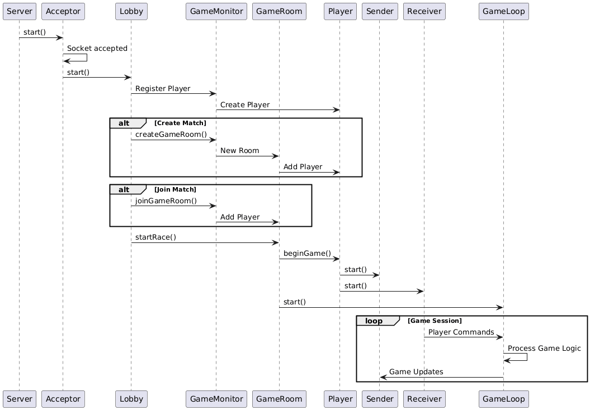
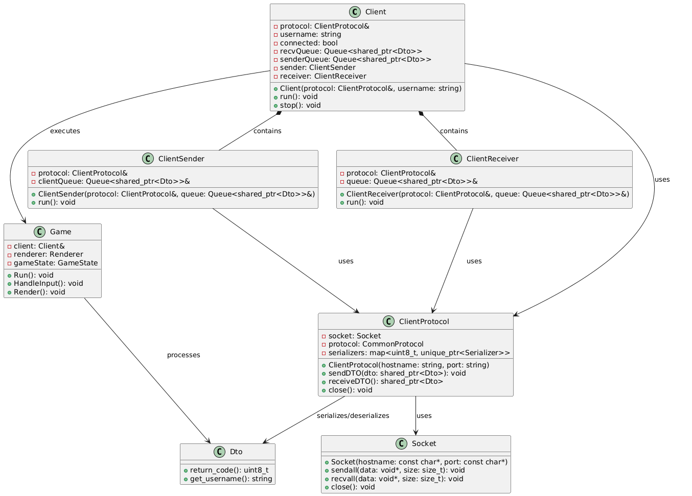
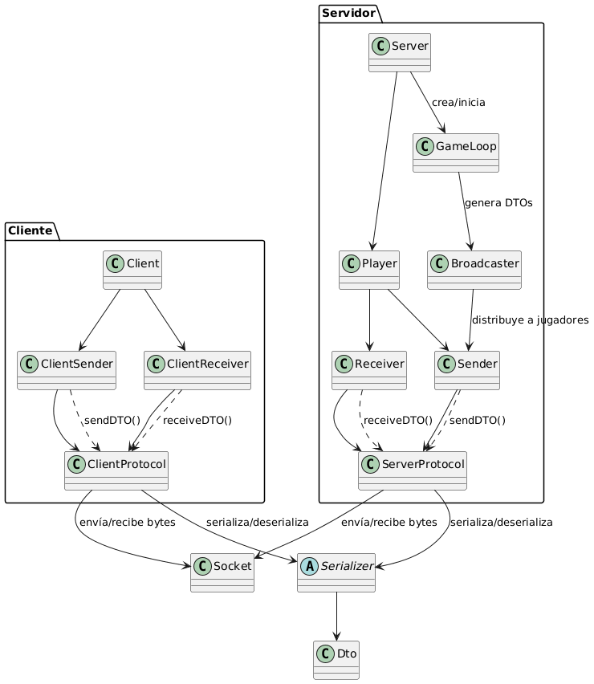
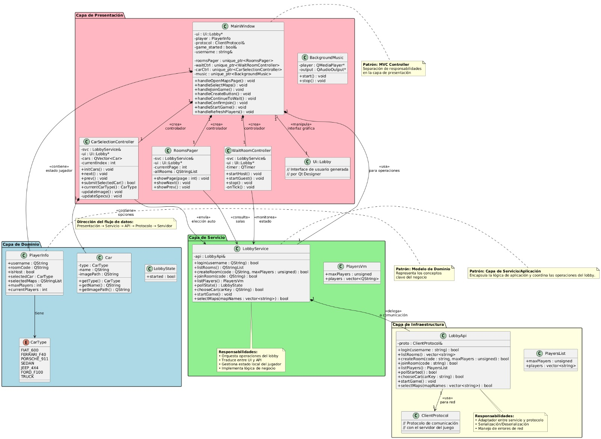
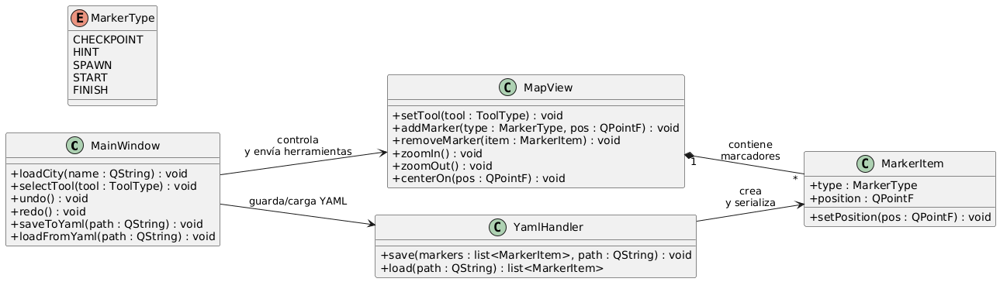
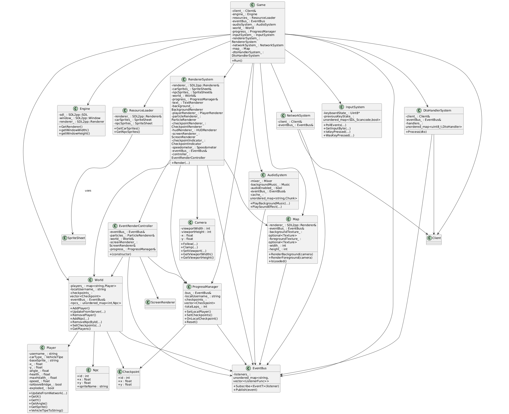
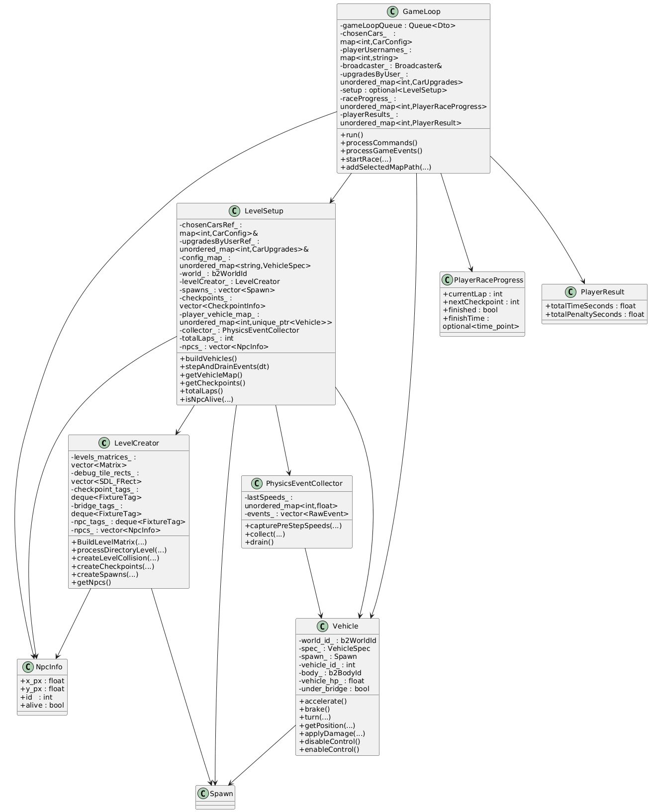

# 📘 Documentación Técnica – Need for Speed 

## Introducción
El objetivo de este manual es **ofrecer una visión clara y comprensible del proyecto**, enfocada en que cualquier desarrollador pueda **entender su funcionamiento interno** y continuar su desarrollo sin dificultades.

Aquí se describen los **componentes principales de la arquitectura**, el formato de los archivos y el **protocolo de comunicación**, acompañados por diagramas que ilustran las interacciones más relevantes entre las partes del sistema.

---

## Arquitectura del servidor
El servidor **centraliza toda la gestión de jugadores y partidas**, encargándose del lobby (la sala de espera), de la creación y configuración de salas y de coordinar el flujo completo de clientes desde el momento en que se conectan hasta que termina cada partida. Su objetivo es **preparar correctamente cada juego** para que los jugadores puedan empezar sin problemas y disfrutar de una experiencia fluida.

La **arquitectura** tiene una organización interna ordenada y mantenible que **permite manejar múltiples partidas simultáneas** y mantener una **comunicación permanente con varios jugadores a la vez**. 
El ciclo del servidor comienza con el `Acceptor`, un hilo dedicado a escuchar nuevas conexiones y crear un hilo `Lobby` para cada jugador que ingresa. Cada instancia de `Lobby` maneja la comunicación inicial con el jugador y coordina las acciones del cliente con el `GameMonitor`, la clase central que administra las partidas en curso y la creación de nuevas salas.

El `GameMonitor` organiza y configura las `GameRoom`, que representan partidas concretas del juego. Una vez los jugadores están listos, la `GameRoom` inicia el `GameLoop`, un hilo independiente que ejecuta la lógica de la carrera: procesa comandos, actualiza el estado del juego y distribuye la información a los clientes. Cada jugador conectado está representado por un objeto `Player`, que mantiene dos hilos: `Sender` y `Receiver`, dedicados respectivamente al envío de actualizaciones y a la recepción de comandos desde el cliente. En conjunto, la separación de responsabilidades y el uso de hilos dedicados hacen que todo funcione de forma ordenada, escalable y eficiente.

### Diagrama de clases del servidor

#### ***Acceptor***
Es el hilo encargado de esperar nuevas conexiones de jugadores. Cada vez que un cliente se conecta, acepta el socket, e inicia un nuevo hilo `Lobby`, que será el responsable de manejar a ese jugador mientras esté en la sala de espera.

#### ***Lobby***
Es el hilo asociado a cada jugador antes de iniciar la partida. Su responsabilidad es interpretar y procesar los pedidos del cliente de la sala de espera: crear sala, unirse a una partida, elegir los recorridos, seleccionar un auto, entre otras acciones. Siempre coordinando con el GameMonitor para estas operaciones.

#### ***GameMonitor***
Administra todas las partidas (`GameRoom`) activas del servidor y coordina la asignación de jugadores a salas. Sus funciones principales son: crear una nueva sala cuando un cliente lo solicita, registrar jugadores a una sala existente, listar las partidas activas porque controla qué jugador pertenece a cada partida. Cuando el `Lobby` necesita interactuar con una sala, debe pasar primero por el `GameMonitor` para obtener la sala correcta.

#### ***GameRoom***
Representa una partida concreta del juego, es decir, administra una única carrera con sus jugadores. Guarda toda la configuración común elegida de la partida (mapas, autos, cantidad de jugadores, etc.) y la lista de jugadores participantes. Además, gestiona la transición de la partida desde el estado `WAITING_FOR_PLAYERS` al estado `IN_RACE` cuando el host inicia la carrera, lo que incluye iniciar el Gameloop e informar a la clase Player del inicio de partida.

#### ***Player***
Representa un jugador conectado al servidor. Cada `Player` administra dos hilos de comunicación: `Sender` (envía actualizaciones del estado del juego al cliente) y `Receiver` (recibe comandos del cliente).

#### ***GameLooop***
Es la clase que maneja la carrera una vez iniciado el juego. En cada ciclo del juego: procesa comandos enviados por los jugadores, actualiza posiciones y estados del juegos, y envía notificaciones a través de la clase `Broadcaster` a cada cliente, es decir, a todos los participantes.

### Diagrama de secuencia del flujo principal del servidor

El diagrama muestra el **flujo completo de interacción entre las distintas clases del servidor**: desde que un jugador se conecta, pasa por el lobby, crea o se une a una sala y finalmente inicia la partida. También ilustra cómo, una vez comenzado el juego, se manejan las acciones del jugador y las actualizaciones de la partida a través del `GameLoop`.

---
## Arquitectura del cliente
El cliente está diseñado para mantener una **comunicación fluida con el servidor**. La clase principal es `Client`, que **administra la conexión, las colas de mensajes y los hilos**: `ClientSender` y `ClientReceiver` encargados del envío y recepción de mensajes. Toda la comunicación se realiza mediante el `ClientProtocol`, que **serializa y deserializa** `DTOs` para enviarlos de forma estructurada por **socket**.

## Comunicación cliente - servidor
La comunicación entre cliente y servidor se basa en un **sistema estructurado y binario de mensajes** `DTO` - **Data Transfer Objects**. Cada mensaje enviado por protocolo, ya sea desde el servidor al cliente o viceversa, se representa como un **objeto `DTO`** que contiene un **código de acción** que identifica el mensaje y los **datos necesarios** para esa operación.

Todos los `DTOs` heredan de una clase base común, lo que permite tratarlos de **forma polimórfica**: facilitando su transmisión y manejo a través del protocolo y las colas de mensajes sin necesidad de conocer su tipo específico de mensaje. 

Para transmitir estos mensajes por socket, cada `DTO` cuenta con un `Serializer` asociado. Esta clase es responsable de **convertir el objeto en una secuencia de bytes** (serialización) y de **reconstruirlo desde bytes en un objeto al recibirlo** (deserialización). El protocolo mantiene un mapa que asocia cada código de acción con su Serializer correspondiente, garantizando que cada tipo de mensaje pueda identificarse y reconstruirse correctamente.

### Estructura del protocolo

Cada mensaje se envía en un paquete que sigue siempre la misma estructura:

- **Código de acción** (un byte): Identifica el tipo de mensaje (ej: `SEND_PLAYER_MOVE`)
- **Tamaño del contenido** (4 bytes): Indica la longitud de los datos serializados.
- **Datos serializados**: contenido específicos del mensaje (por ejemplo, comandos de jugador, información del lobby o estados del juego)

El proceso está encapsulado dentro de `ClientProtocol` y `ServerProtocol`: cuando el servidor o cliente quiere enviar un mensaje, simplemente crea un `DTO`, el protocolo lo serializa, envía su tamaño y finalmente lo envía por el socket. Del otro lado, el protocolo lee el código, recibe el tamaño del mensaje, identifica qué Serializer utilizar y reconstruye el DTO desde su representación binaria.
Difusión de mensajes a todos los jugadores

Para los **mensajes que deben llegar a todos los jugadores de una partida**, el servidor utiliza un sistema de **broadcast** basado en `DTOs`, que distribuye los mensajes a todos los clientes conectados de esa sala. El `GameLoop` genera los eventos del juego y los envía al `Broadcaster`, que coloca el mismo `DTO` en la cola individual de cada jugador de la sala.

Cada `Player` tiene un hilo `Sender` propio que consume su cola individual y envía los mensajes mediante su `ServerProtocol`, garantizando que el flujo principal del juego no se bloquee y que todos los participantes reciban las actualizaciones de forma consistente.

---

## Arquitectura del Lobby

El sistema de lobby está diseñado con una **Arquitectura en tres capas: Presentación, Servicio e Infraestructura**  que facilitan el mantenimiento y la escalabilidad. En la **capa de presentación** encontramos la ventana principal `MainWindow` que actúa como coordinador central, delegando responsabilidades específicas a controladores especializados. Estos controladores incluyen un paginador para la lista de salas, un gestor para la sala de espera que implementa polling periódico, y un controlador para la selección de vehículos que maneja la navegación y confirmación de autos.

La **capa de servicio** contiene la lógica de negocio principal a través de `LobbyService`, que orquesta todas las operaciones del lobby y mantiene el estado local del jugador. Esta capa sirve como intermediario entre la interfaz de usuario y la infraestructura de comunicación, traduciendo entre los tipos de datos de Qt y el protocolo del servidor. 

Finalmente, la **capa de infraestructura** maneja la comunicación directa con el servidor del juego. Esta capa se encarga de la serialización y deserialización de mensajes, el manejo de la conexión y la traducción entre las operaciones de alto nivel y los comandos específicos del protocolo. Aquí es donde se implementan los detalles concretos de cómo se envía y recibe información a través de la red, manteniendo estos aspectos técnicos aislados del resto del sistema.

Los flujos de interacción siguen patrones consistentes donde las acciones del usuario pasan desde la interfaz hasta el servidor en una cadena de delegación. Cuando un jugador crea o se une a una sala, la solicitud viaja desde `MainWindow` hasta `LobbyService`, luego a `LobbyApi`, y finalmente al servidor a través del protocolo de cliente `ClientProtocol`. La sala de espera implementa un sistema de polling que consulta periódicamente el estado del juego, permitiendo detectar cuándo todos los jugadores están listos para proceder a la selección de vehículos.

La selección de autos constituye otro flujo importante donde el usuario navega entre opciones visuales mientras el controlador mantiene un índice actual y actualiza la interfaz en tiempo real. Al confirmar la elección, esta se envía al servidor para sincronización con las selecciones de otros jugadores. Toda la arquitectura sigue principios de separación de preocupaciones, permitiendo que cada componente tenga responsabilidades bien definidas y minimizando el acoplamiento entre capas.

### Diagrama de Clases

### Diagrama de Secuencia

---

## Arquitectura del Editor

El editor de mapas es una herramienta construida con Qt que permite diseñar recorridos para las carreras del juego. 

Su arquitectura está compuesta por cuatro elementos principales:

- **MainWindow**: Es la ventana principal y el centro de control del editor. Maneja las herramientas, carga y guarda mapas y coordina todas las acciones del usuario.

- **MapView**: Es el área gráfica donde se edita el mapa. Permite colocar, mover y eliminar elementos mediante el mouse, además de manejar zoom y desplazamiento.

- **MarkerItem**: Representa cada objeto del recorrido (checkpoints, hints, spawn, inicio y meta). El MapView contiene muchos MarkerItem y se encargan de dibujarlos y almacenar su posición.

- **YamlHandler**: Se ocupa de guardar y cargar los mapas en un archivo YAML. Convierte los MarkerItem en datos y reconstruye la escena al abrir un mapa.

En conjunto, estos componentes permiten que el usuario diseñe recorridos visualmente y los exporte en un formato que el juego puede utilizar directamente.

---

## Arquitectura del cliente gráfico

El cliente gráfico, construido sobre la biblioteca SDL2pp, es el responsable de recibir, interpretar y visualizar toda la información enviada por el servidor a través del protocolo de red.
Para lograr un diseño flexible y desacoplado, el cliente utiliza principalmente un patrón de arquitectura Publisher–Subscriber:
cuando llega un DTO desde la red, se publica un evento, y cada módulo del cliente puede suscribirse a él y actuar en consecuencia, evitando la necesidad de propagar manualmente los DTO a todas las clases interesadas.

### Módulos principales del cliente:

- **Engine**: Inicializa SDL2pp y crea los recursos base del motor gráfico, como la ventana y el renderer. Es la capa de bajo nivel sobre la que se apoya el resto del cliente.

- **Game**: Es la clase que orquesta el funcionamiento del juego. Decide cuando ocurre cada cosa y asegura el correcto funcionamiento.

- **Resource Loader**: Carga los recursos estáticos (spritesheets de vehículos y NPCs) desde archivos.

- **Renderer System**: Coordina el pipeline de renderizado.
Determina el orden en que se dibujan los distintos elementos del juego (mapa, vehículos, partículas, HUD, UI, etc.), y delega la tarea concreta a los distintos renderers especializados:
BackgroundRenderer, PlayerRenderer, ParticleRenderer, HUDRenderer, ScreenRenderer, etc.

- **DtoHandlerSystem**: Implementa el patrón Strategy para manejar cada tipo específico de DTO.
Cada DTO recibido se procesa utilizando un handler particular que decide qué acciones ejecutar (por ejemplo, actualizar posiciones, crear NPCs, aplicar daños, etc.).
Publica eventos hacia el EventBus.

- **Network System**: Envía comandos desde el cliente hacia el servidor (por ejemplo, movimientos del jugador o eventos especiales).
Funciona como la contraparte del DtoHandlerSystem.

- **Event Bus y Event**: Son el corazón del sistema de comunicación interna.
Permiten que cualquier módulo publique un evento y que otros módulos se suscriban para reaccionar sin acoplamiento directo.
Algunos ejemplos:
  - PlayerMoveEvent
  - CheckpointCompletedEvent
  - RaceInfoEvent
  - VehicleExplodedEvent

- **Audio System**: Reproduce efectos de sonido y música de fondo en respuesta a eventos del juego o entradas del usuario.

- **Input System**: Detecta las teclas presionadas por el usuario y las transforma en acciones del juego (por ejemplo, acelerar, girar, activar cheats durante el desarrollo, etc.).

### Clases encargadas del estado del juego

- **World**: Es la clase principal encargada de gestionar el estado interno del juego:
  - Lista de jugadores y su información
  - NPCs presentes
  - Posiciones, velocidades, ángulos
  - Colisiones
El World es actualizado mediante los DTOs recibidos desde el servidor.

- **Player**: Representa a un jugador en la partida, incluyendo:
  - Posición y orientación
  - Vida
  - Velocidad
  - Vehículo utilizado
  - Estado (explosionado, sobre puente, etc.)

- **Camera**: Determina qué parte del mapa debe mostrarse en pantalla.
Sigue la posición del jugador local y se asegura de no salirse de los límites del mapa.

- **Progress Manager**: Maneja el estado del progreso del jugador:
  - Checkpoint actual
  - Checkpoints ya pasados
  - Vueltas completadas
  - Eventos de checkpoint para el HUD

- **Map**: Carga las texturas del mapa (background y foreground) y provee su tamaño, necesario para la cámara y el renderizado.

### Renderers especializados y UI

Además del RendererSystem, existen renderers específicos que saben cómo dibujar cada tipo de entidad:

- CheckpointRenderer → dibuja los checkpoints según estado

- PlayerRenderer → renderiza cada jugador con su sprite y su dirección

- ParticleRenderer → humo, explosiones, chispas, etc.

- HUDRenderer → elementos superpuestos como texto, vidas, vueltas

#### La UI está compuesta por elementos interactivos como:

- Minimap: muestra la pista y la posición relativa de los jugadores

- Speedometer: renderiza el velocímetro del vehículo

- CheckpointIndicator: indica la dirección del próximo checkpoint

Cada componente UI conoce cómo dibujarse y utiliza datos provenientes del World o del ProgressManager.

---

## Arquitectura del servidor de fisicas

### LevelSetup

`LevelSetup` es el módulo encargado de construir el **mundo físico** con Box2D y preparar una carrera.  
Sus responsabilidades principales son:

- Inicializar el mundo (`b2World`) con su configuración.
- Crear vehículos jugadores y NPCs.
- Cargar configuraciones de autos (`VehicleSpec`) y aplicar mejoras (`CarUpgrades`) a cada jugador.
- Construir el nivel utilizando `LevelCreator`, incluyendo:
  - colisiones  
  - checkpoints  
  - spawns  
  - NPCs  
- Avanzar la simulación física mediante `stepAndDrainEvents`.
- Registrar eventos físicos capturados por `PhysicsEventCollector`.
- Proveer acceso a:
  - vehículos (`getVehicleMap`)
  - checkpoints
  - NPCs vivos
  - total de vueltas

El objeto mantiene referencias a configuraciones externas, un generador aleatorio y las colecciones resultantes del nivel (vehículos, checkpoints y NPCs).

## GameLoop

`GameLoop` es el **núcleo del servidor de juego**.  
Corre en su propio hilo (hereda de `Thread`) y ejecuta permanentemente:

- Procesamiento de comandos entrantes (`processCommands`)
- Avance de la simulación física (`processGameEvents`)
- Manejo de lógica de carrera:
  - vueltas  
  - checkpoints  
  - explosiones  
  - posiciones  
  - fin de carrera  
  - penalizaciones  
  - múltiples carreras (rotación de mapas)
- Envío de actualizaciones al cliente:
  - posiciones  
  - checkpoints  
  - autos iniciales  
  - resultados finales  

Utiliza una instancia de `LevelSetup`.  
Mantiene el estado de cada jugador mediante:

- `PlayerRaceProgress`
- `PlayerResult`
- `raceProgress_`
- `playerResults_`

Además gestiona control de vehículos (habilitar/deshabilitar), cuenta regresiva, explosiones, colisiones y transición entre carreras.

## 👾 NpcInfo

`NpcInfo` es una estructura liviana que representa un NPC dentro del mundo físico.

Incluye:

- posición en píxeles  
- id  
- estado (vivo / muerto)

Es utilizada por `LevelSetup`, `LevelCreator` y por el servidor para enviar información del estado de los NPCs a los clientes.

## PhysicsEventCollector

`PhysicsEventCollector` recolecta los eventos generados durante la simulación física de Box2D, tales como:

- colisiones entre vehículos  
- colisiones con paredes  
- paso por checkpoints  
- colisión con NPCs  
- entrada / salida de puentes  

Métodos principales:

- **`collect(world)`** → inspecciona los contactos de Box2D y genera eventos.  
- **`drain()`** → devuelve y limpia todos los eventos acumulados.  
- **`capturePreStepSpeeds(...)`** → almacena velocidades antes del paso físico.

Los eventos se almacenan como `std::variant<RawEvent>` para representar distintos tipos de interacciones físicas.

## Vehicle

`Vehicle` representa un vehículo dentro del mundo físico.

Responsabilidades:

- Crear el cuerpo Box2D del vehículo.  
- Ejecutar acciones: acelerar, frenar, girar.  
- Obtener posición, ángulo y dimensiones.  
- Aplicar daño y manejar los puntos de vida.  
- Detectar si está debajo de un puente.  
- Habilitar o deshabilitar control (por cuenta regresiva, explosión, etc.).  
- Dibujar en modo debug.  

Atributos clave:

- `VehicleSpec` (especificación del auto)  
- spawn inicial  
- cuerpo físico (`b2BodyId`)  
- estado de vida  
- identificador del jugador  

## 🏗️ LevelCreator

`LevelCreator` es responsable de construir la **geometría del mapa**:

- Leer matrices de nivel desde archivos.  
- Crear colisiones en Box2D según el diseño del mapa.  
- Generar checkpoints físicos.  
- Crear ubicaciones de spawn válidas.  
- Crear y posicionar NPCs.  
- Renderizar tiles y checkpoints en modo debug.

Mantiene:

- matrices del nivel  
- rectángulos de debug  
- tags para colisiones  
- NPCs generados  

Es utilizado exclusivamente por `LevelSetup` para armar el escenario físico.

## 📍 Spawn

Estructura simple que representa la posición inicial y el ángulo de un vehículo:

- `x`: posición X  
- `y`: posición Y  
- `angle`: ángulo de rotación inicial  

Utilizado por `Vehicle`, `LevelCreator` y `LevelSetup`.

