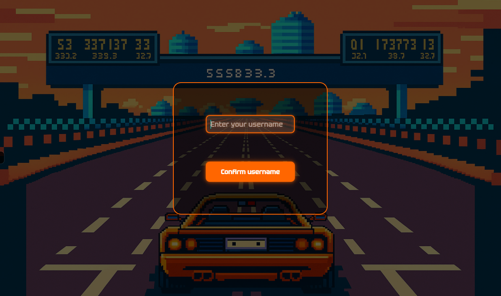
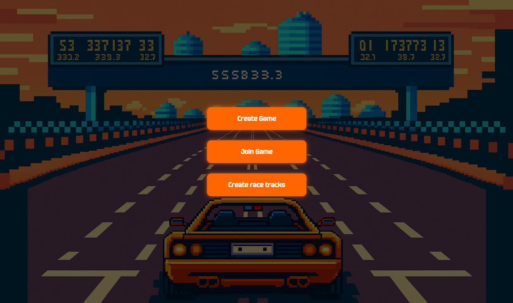
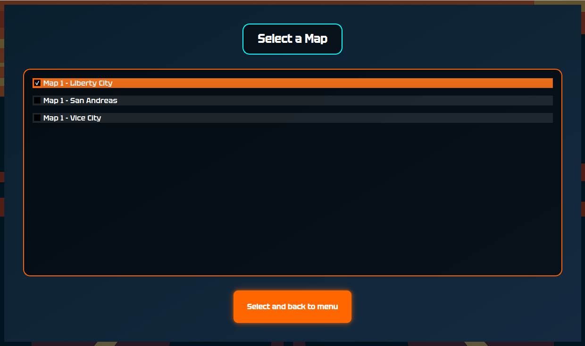
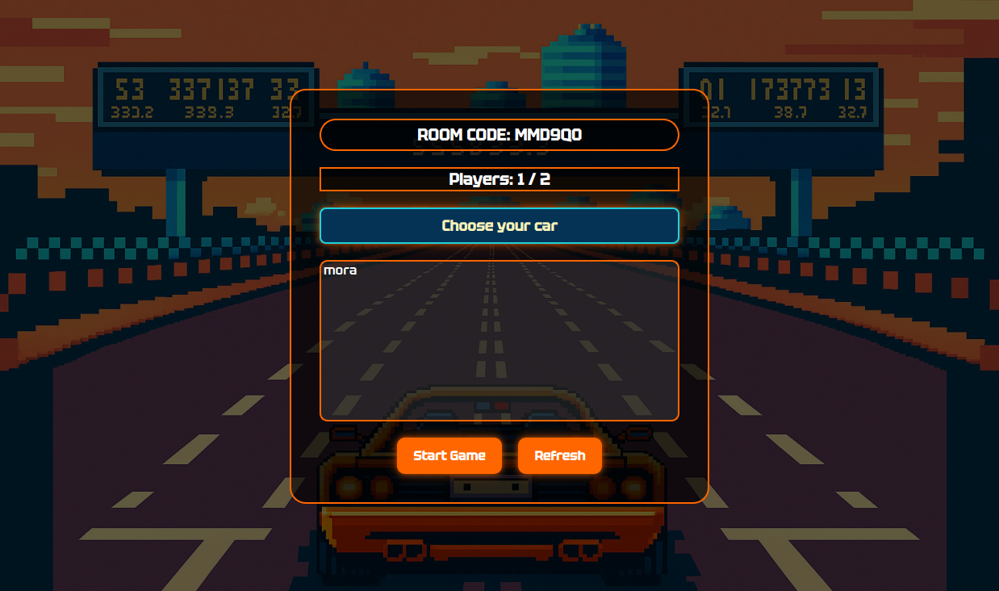
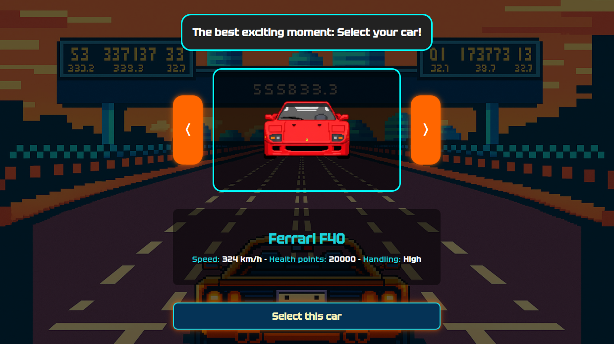
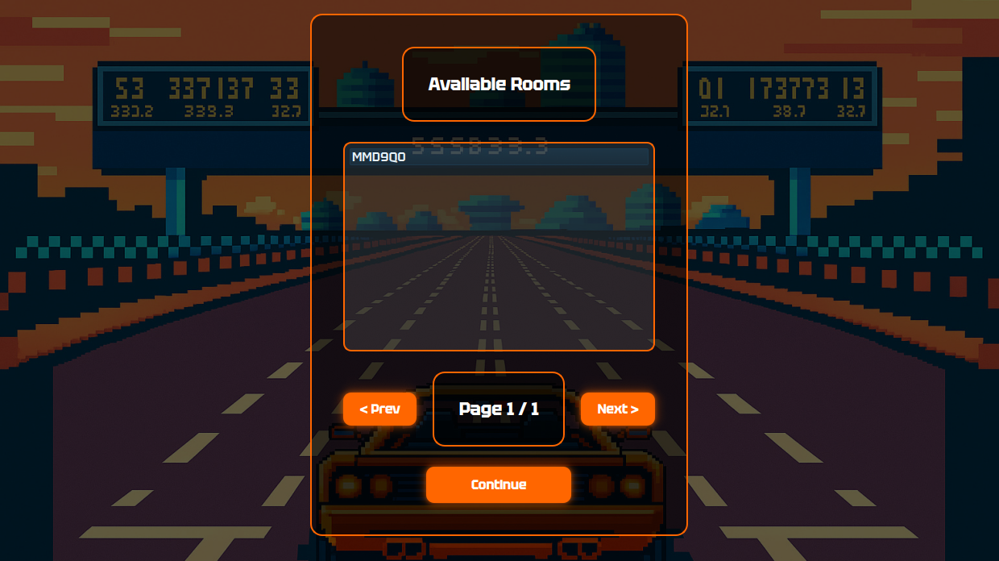
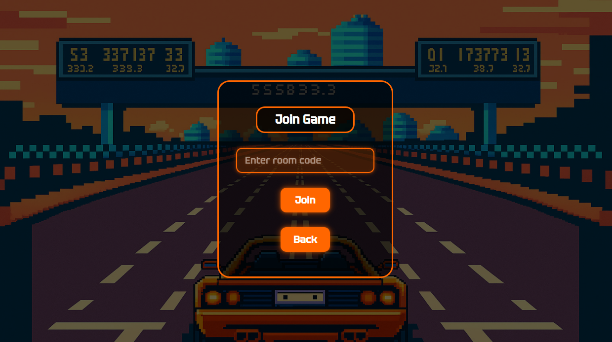
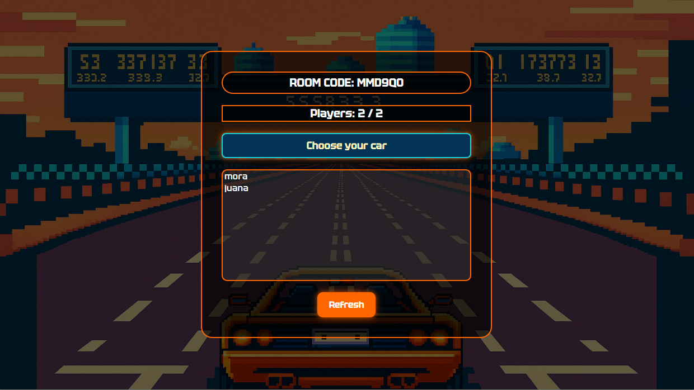
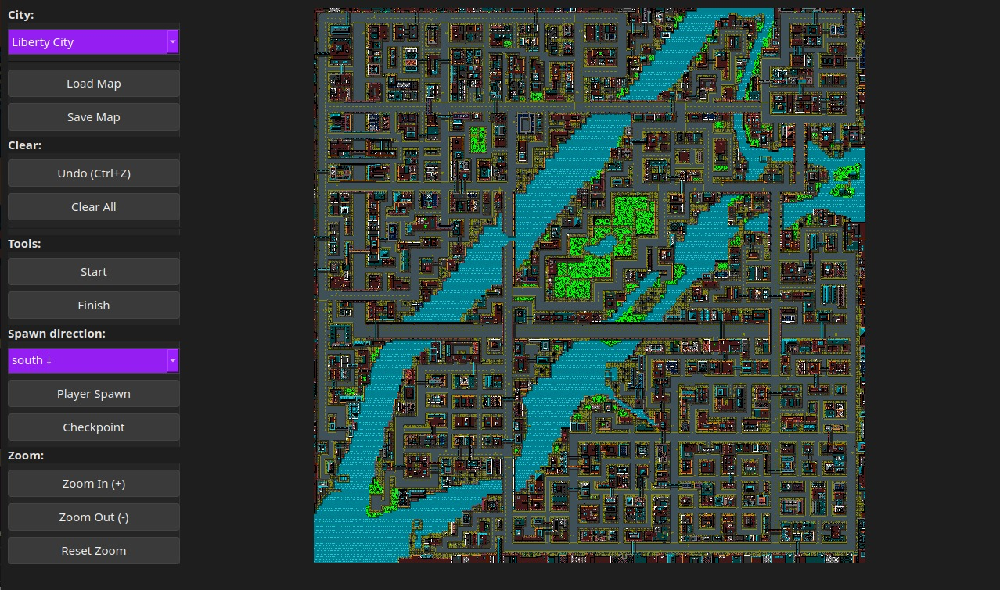

# 📘 Manual del Usuario – Need for Speed 

Este documento explica cómo **instalar**, **compilar**, **configurar** y **usar** el juego desarrollado para Taller de Programación I. Está escrito para usuarios sin conocimientos profundos sobre programación, por lo que utiliza un lenguaje claro y directo.

---

## 📑 Índice

* [1. Instalación y Requisitos](#instalacion)
* [2. Instalación y Compilación](#compilacion)
* [3. Ejecución del Software](#ejecucion)
* [4. Uso del Juego: Lobby y Flujo General](#lobby)
* [5. Editor de Mapas (Race Track Editor)](#mapas)
* [6. Controles del Juego](#juego)
* [7. Objetivo y Dinámica del Juego](#objetivo)
* [8. Servidor](#servidor)

---

<h2 id="instalacion">1. ⚙️ Instalación y Requisitos</h2>

El proyecto fue desarrollado y probado en **Ubuntu 22.04 / 24.04**. Se recomienda utilizar **Linux** para evitar problemas de compilación.

---

<h2 id="compilacion">2. 🔨 Instalación y Compilación</h2>

Para instalar las dependencias necesarias, en la **raíz del proyecto** ejecuta:

```bash
make install
```
El target se encargará de **instalar las dependencias necesarias para el juego, compilarlo** y finalmente **instalar el juego** en el sistema.

**Limpiar compilación**:

```bash
make clean
```

**Desinstalar**:

```bash
make uninstall
```
---

<h2 id="ejecucion">3. 🚀 Ejecución del Software</h2>
Ejecutar los siguientes comandos en terminales separadas desde la raíz del proyecto:

**Levantar el servidor**
```bash
nfs_server <puerto>
```

Ejemplo:
```bash
nfs_server 8080
```

**Abrir el cliente**
En otra terminal:
```bash
nfs_client <host> <puerto>
```

Ejemplo:
```bash
nfs_client 127.0.0.1 8080
```

**Abrir el editor de mapas**
Podés abrirlo desde el lobby del cliente o directamente desde la terminal:
```bash
nfs_editor
```

**Ejecutar tests**
```bash
nfs_tests
```

---

<h2 id="lobby">4. 🎮 Uso del Juego: Lobby y Flujo General</h2>
Al abrir el cliente verás una pantalla inicial donde podrás conectarte al servidor. 


Luego de presionar el botón `Connect` te aparecerá un cartel de que te has concectado con éxito y luego ingresarás tu nombre de usuario



Una vez ingresado y clickeado el botón `Confirm username` verás el siguiente menú principal:



Opciones disponibles:

- `Create Game` → Crear una partida

- `Join Game` → Unirse a una partida existente

- `Create Race Tracks` → Abrir el editor de mapas y crear un recorrido

Veamos que hace cada opción en detalle:

### 🏁 Crear una partida
El flujo es:

1. **Seleccionar recorridos**: Primero selecciona los recorridos que deseas jugar en la partida. Cada recorrido es un circuito (carrera) que se jugará dentro de la partida. Puedes seleccionar más de uno.



Luego de tocar el botón `Select and back to menu` verás la siguiente sala:

2. **Crear sala**: Selecciona la cantidad de jugadores y obtendrás un room code para enviarle a tus amigos.


Luego de tocar el botón `Continue` verás la sala de espera

3. **Sala de espera**: Aquí puedes seleccionar el auto con el que correrás en la partida presionando el botón `Choose your car`, y también podrás esperar hasta que el host inicie la partida.



- **Elegir tu auto** → Disponés de **7 vehículos** distintos, y podés visualizarlos usando las flechas laterales. Cada uno tiene su propio estilo de conducción y difieren en:

    - ⚡ **Velocidad máxima**
    - 🏎️ **Aceleración**
    - 🛡️ **Salud**
    - 🧱 **Masa**
    - 🎮 **Controlabilidad**

Por ejemplo, un camión tendrá una velocidad y aceleración menores que un auto deportivo pero tendrá más salud, masa y controlabilidad. 



**Elegís un solo auto y te acompaña durante todas las carreras de la partida**.
🏁 **No hay segundas oportunidades**: elegí bien tu máquina de batalla.


Una vez seleccionado el auto (luego de tocar el botón `Select this car`) serás redirigido nuevamente a la sala de espera.

- **Ver los jugadores conectados** → Al tocar el botón `Refresh` podes ir actualizando la página para ir viendo si se van uniendo el resto de jugadores.

- **Iniciar la partida (solo el host)** → El único jugador que puede iniciar el juego tocando el botón `Start game` es el host (quien crea la sala).

---

### 👥 Unirse a una partida

Si en el menú principal seleccionas el botón `Join Game` primero verás las salas disponibles que existen en el momento.



De aquí podrás copiar el código de la sala para pegarlo en la próxima página que aparece luego de presionar el botón `Continue`, donde ingresarás el código.



Luego de tocar el botón `Join` entras en la sala de espera para:



- **Elegir tu auto** → Disponés de **7 vehículos** distintos, y podés visualizarlos usando las flechas laterales. Cada uno tiene su propio estilo de conducción y difieren en:

    - ⚡ **Velocidad máxima**
    - 🏎️ **Aceleración**
    - 🛡️ **Salud**
    - 🧱 **Masa**
    - 🎮 **Controlabilidad**

Por ejemplo, un camión tendrá una velocidad y aceleración menores que un auto deportivo pero tendrá más salud, masa y controlabilidad. 


**Elegís un solo auto y te acompaña durante todas las carreras de la partida**.
🏁 **No hay segundas oportunidades**: elegí bien tu máquina de batalla.

- **Ver a los demás jugadores** → Al tocar el botón `Refresh` podes ir actualizando la página para ir viendo si se van uniendo el resto de jugadores.

- **Esperar a que el host inicie la carrera** 

---

<h2 id="mapas">5. 🗺️ Editor de Mapas (Race Track Editor)</h2>

El editor permite **crear circuitos personalizados** que luego pueden jugarse en el servidor. Estos serán visualizados cuando se crea una partida en la página donde hay que seleccionar los recorridos que contendrá la partida.

Puede abrirse desde:

- El menú principal del cliente, presionando el botón `Race Track Editor`

- O desde la terminal → `nfs_editor`



El recorrido consta de:

- **Seleccionar una ciudad**: Liberty City, Vice City o San Andreas

- **Colocar los elementos del recorrido**:

    - `Start` → inicio de la carrera
    
    - `Finish` → meta final


    - `Player Spawn` → posiciones iniciales de autos. Previamente se debe seleccionar que ángulo se desea que tenga cada posición.

    - `Checkpoints` → marcan el camino

Para realizar el circuito puedes:
- Hacer **zoom** y desplazarte por el mapa, con los botones `Zoom In (+)` o `Zoom Out (-)`, o sino también con el touchpad.
- Si prefieres ver todo el mapa como desde el inicio puedes tocar el botón `Reset zoom`
- Deshacer el último cambio con **Ctrl Z**
- Borrar todo con `Clear All`


### 💾 Guardar y Cargar Mapas:
- **Guardar**: Haz clic en `Save Map` y solo elige el nombre del mapa! Por defecto se aplica la  extensión.yaml y se coloca el archivo en server/maps para que sea jugable. Si lo guardas en otro lugar no será utilizado.
- **Cargar**: Haz clic en `Load Map` y selecciona un archivo existente para seguir editando.

---
<h2 id="juego">6. 🕹️ Juego</h2>

### 🎮 Controles del Juego

| Acción | Tecla(s) |
|--------|----------|
| **Avanzar / Acelerar**   |   **w ⬆️** |
| **Girar a la izquierda** | **w + a ⬆️⬅️** |
| **Girar a la derecha**   | **w + d ⬆️➡️** |
| **Retroceder / Marcha atrás** | **s ⬇️** |

### 😶‍🌫️ Cheats
En **cualquier momento de la partida** podés activar distintos cheats para probar el juego o facilitar la experiencia. 

**Cheats disponibles**:
| Acción | Tecla(s) |
|--------|----------|
|  **Vida infinita**   |   **q** |
| **Finalizar carrera para tu juagor** | **e** |

### ⚡ Mejoras
Al finalizar cada carrera y hasta unos 10 segundos de arrancar la siguiente, **cada jugador podrá mejorar algunas de las propiedades de su auto**. Por ejemplo, podrá hacerlo un poco más rápido. Cada mejora tiene un **costo** que se computa como una **penalización** del tiempo de llegada de la siguiente carrera. 

**Mejoras disponibles**:
| Acción | Penalización |
|--------|----------|
|  **Aumentar Salud** (Improve health)  |   **+1s** |
| **Aumentar velocidad** (Improve speed) | **+1s** |


<h2 id="objetivo">7. 🎯 Dinámica y Objetivo del Juego</h2>

**¡Bienvenido a la pista!** Cada partida puede incluir una sola carrera... o una verdadera maratón de circuitos consecutivos.
Tu misión no es solo manejar: es sobrevivir a la velocidad, a los giros cerrados y a tus rivales.

Para completar una carrera:

- 🚦 Largás desde tu **posición inicial** esperando el momento justo para acelerar.

- 🔵 Pasás por todos los **checkpoints**, que van marcando el camino correcto.

- 🏹 Seguís las **flechas** de ayuda, que te indican cuándo doblar, cuándo seguir de largo o cuándo prepararte para una curva traicionera.

- 🏁 Cruzás la **meta** a toda velocidad, intentando no chocarte en el último segundo.

Si la partida tiene varios circuitos, no te relajes: apenas termina uno… ¡arranca el siguiente!

🏆 **Gana el jugador que cruce primero la meta en cada carrera**. 
**Velocidad, precisión y estrategia**: acá no gana el que acelera más… sino el que sabe cuándo hacerlo.

---
<h2 id="servidor">8. 🌐 Servidor</h2>

Para cerrar el servidor, escribe la letra `q` en la terminal donde fue ejecutado.

